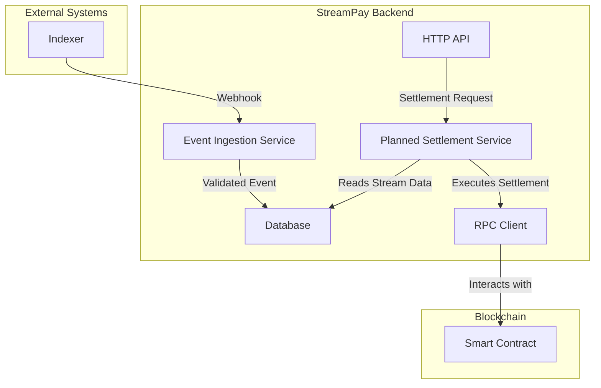

# StreamPay Backend Architecture

This document provides an overview of the StreamPay backend architecture, its components, and the data flow for key operations.

## Components

The backend is composed of the following main components:

- **HTTP API:** A public-facing API for managing streams, metering, and settlements.
- **Workers:** Background services for handling asynchronous tasks like event ingestion, outbound webhook delivery, and processing.
- **Database:** A PostgreSQL database for storing stream data, account information, and other persistent data.
- **Redis:** An in-memory data store for caching and managing distributed locks.
- **RPC Clients:** Clients for interacting with blockchain nodes for on-chain operations.

## Data Flow

### Stream Settlement

The following diagram illustrates the data flow for stream settlement:

**Steps:**

1. The **Indexer** sends a webhook to the **Event Ingestion Service** when a stream is created or updated.
2. The **Event Ingestion Service** validates the webhook and stores the event data in the **Database**.
3. A user initiates a settlement through the **HTTP API**.
4. The **Planned Settlement Service** reads the stream data from the **Database**.
5. The **Planned Settlement Service** uses the **RPC Client** to execute the settlement on the blockchain.
6. The **RPC Client** interacts with the **Smart Contract** to perform the settlement.

> Current implementation note: there is no `src/services/settlementService.ts` module yet. Current settlement-adjacent behavior is implemented by `src/services/accrualService.ts`, `src/services/transactionService.ts`, `src/services/eventIngestionService.ts`, `src/services/webhookDeliveryService.ts`, and `src/clients/sorobanClient.ts`. See [Accrual, Webhook Delivery, and Settlement Semantics](./accrual-and-settlement.md) for code-grounded details.

## Code Layout

The Express application is organized by responsibility:

- `src/api/` — versioned HTTP routers (currently `/api/v1`).
- `src/middleware/` — authentication, validation, and rate-limit middleware.
- `src/services/` — pure business logic with no Express coupling.
- `src/repositories/` — Drizzle-backed data access for each table.
- `src/db/` — schema definitions and the shared connection pool.
- `src/metrics/` — Prometheus instrumentation.
- `src/cache/` — Redis client and cache wrappers.
- `src/clients/` — external service clients (Soroban, indexer, etc.).
- `src/utils/` — small dependency-free helpers shared across modules.

Tests live next to the code they exercise (`*.test.ts`) so the import graph
matches the production graph.
